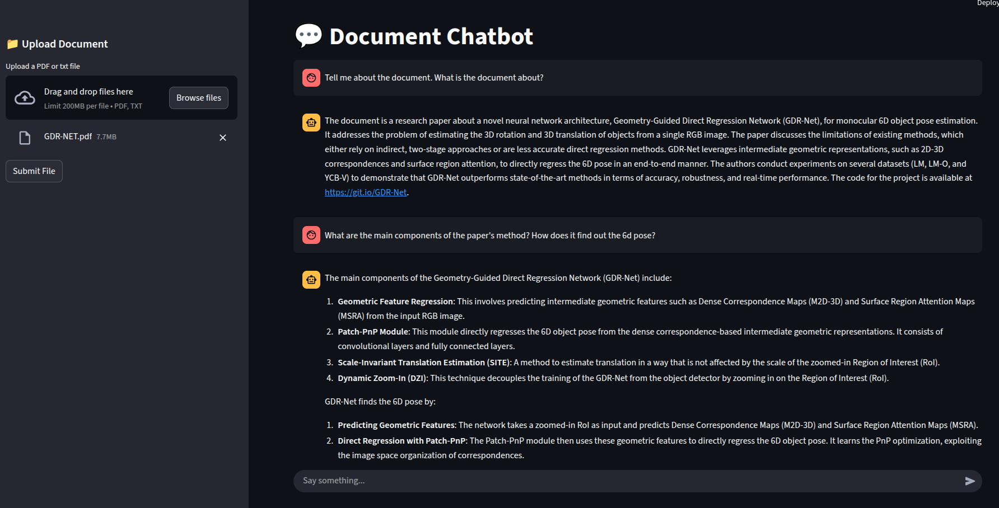

# 📄 Document Chatbot

A smart, interactive chatbot that lets you **upload PDF documents** and **chat** with them using state-of-the-art **Large Language Models (LLMs)** like **OpenAI GPT** and **Google Gemini**. This app helps you query your documents naturally and get intelligent responses — all through a sleek **Streamlit** interface.

---

## 🚀 Features

- 📁 Upload your PDF document
- 🤖 Chat with the content using LLMs (OpenAI or Gemini)
- 🔍 Ask questions and get accurate answers based on your document
- ⚙️ Backend built with `Streamlit`, `PyPDF2`, OpenAI & Gemini APIs
- 📄 Extracts and uses PDF content as **contextual grounding** for each query

---

## 🧠 How It Works

1. **Upload** a PDF using the Streamlit UI.
2. The app uses **PyPDF2** to extract all text from the document.
3. The extracted content is sent as **context** to the LLM (OpenAI/Gemini).
4. You ask questions, and the LLM responds **based solely on the uploaded document.**

---

---

## 🎥 Demo Image


---

## 🛠️ Tech Stack

- **Frontend/UI:** Streamlit
- **Backend:** Python, OpenAI API, Google Gemini API
- **PDF Text Extraction:** PyPDF2
- **LLM Integration:** Context-aware query answering using prompts

---

## 📦 Installation

Clone the repository and install the required packages:

```bash
git clone https://github.com/your-username/document-chatbot.git
cd document-chatbot
pip install -r requirements.txt
